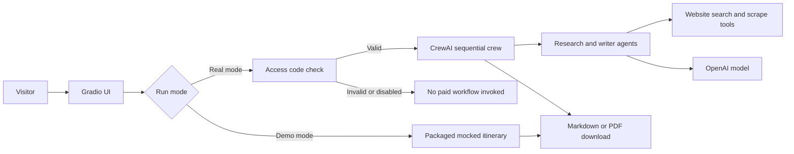

# National Park Trip Planner

A portfolio-grade AI trip planner that uses a CrewAI multi-agent workflow to research airports, flights, lodging, national park activities, and a final itinerary. The public UI includes a mocked demo mode for safe recruiter review and a gated real-run mode for authorized users.

## Highlights

- Multi-agent CrewAI pipeline with role-specific research and writing agents.
- Gradio web UI with streamed progress updates and downloadable Markdown/PDF output.
- Public mocked demo mode that never calls OpenAI, CrewAI tools, web search, or paid APIs.
- Access-code-gated real mode controlled by server-side environment secrets.
- Python project managed with `uv`, tested with `pytest`, and deployable as a Hugging Face Docker Space.

## Tech Stack

- **Language:** Python 3.10-3.13
- **Agent framework:** CrewAI
- **UI:** Gradio
- **Exports:** Markdown and PDF via ReportLab
- **Dependency management:** uv
- **Testing:** pytest and pytest-cov
- **Deployment target:** Hugging Face Spaces using Docker

## Architecture



The important safety boundary is in `planner_service.py`: demo mode returns packaged sample content immediately, while real mode validates `REAL_RUNS_ENABLED` and `REAL_RUN_ACCESS_CODE` before the CrewAI workflow can start.

## Project Structure

```text
national_park_crew/
|-- pyproject.toml
|-- src/national_park_crew/
|   |-- app.py                    # Gradio UI
|   |-- planner_service.py        # Validation, demo mode, access gate, CrewAI runner
|   |-- crew.py                   # CrewAI agents/tasks wiring
|   |-- export_utils.py           # Markdown/PDF download helpers
|   |-- demo_data/                # Packaged mocked itinerary data
|   `-- config/
|       |-- agents.yaml           # Agent roles, goals, and model choices
|       `-- tasks.yaml            # Sequential planning tasks
`-- tests/
    |-- test_planner_service.py
    `-- test_export_utils.py
```

## Run Locally

Install `uv` if needed:

```bash
pip install uv
```

Install dependencies and start the Gradio UI:

```bash
cd national_park_crew
uv sync
uv run run_ui
```

Open `http://localhost:7860`.

By default, the UI runs in **Demo mode - mocked data**. That path does not require API keys.

## Real CrewAI Runs

Real runs require environment variables. Copy the example file and add your secrets:

```bash
cd national_park_crew
cp .env.example .env
```

Required for real runs:

- `OPENAI_API_KEY`: OpenAI key used by CrewAI agents.
- `REAL_RUNS_ENABLED=true`: Enables authorized real runs.
- `REAL_RUN_ACCESS_CODE`: Private code entered in the UI to unlock real execution.

Optional operational toggles:

- `CREWAI_DISABLE_TELEMETRY=true`
- `OTEL_SDK_DISABLED=true`

If `REAL_RUNS_ENABLED` is false or the access code is missing/incorrect, the app refuses the real run before invoking CrewAI or paid APIs.

## Test

```bash
cd national_park_crew
uv run --group dev pytest
```

The tests cover request validation, mocked demo mode, real-run access gating, streamed planner updates, and export-file generation.

## Deployment Notes

The app is designed for a Gradio-based portfolio demo. Hugging Face Spaces is the preferred public demo host, but this project uses a **Docker Space** rather than the default Gradio SDK so dependency versions stay under project control.

Recommended public setup:

- Link the Hugging Face Space as the **Live Demo**.
- Link this GitHub repository as **View Code**.
- Run the public Space in demo mode by default.
- Store `OPENAI_API_KEY`, `REAL_RUNS_ENABLED`, and `REAL_RUN_ACCESS_CODE` as Hugging Face Secrets, not in source control.

See `national_park_crew/DEPLOYMENT.md` for additional deployment context.

## Why This Project Matters

This project demonstrates practical AI application engineering rather than a simple prompt wrapper: agent decomposition, external tool use, UI streaming, file export, test coverage, secret handling, and cost-aware demo controls. The public mock mode is intentional so reviewers can evaluate the product experience without triggering paid LLM usage.
