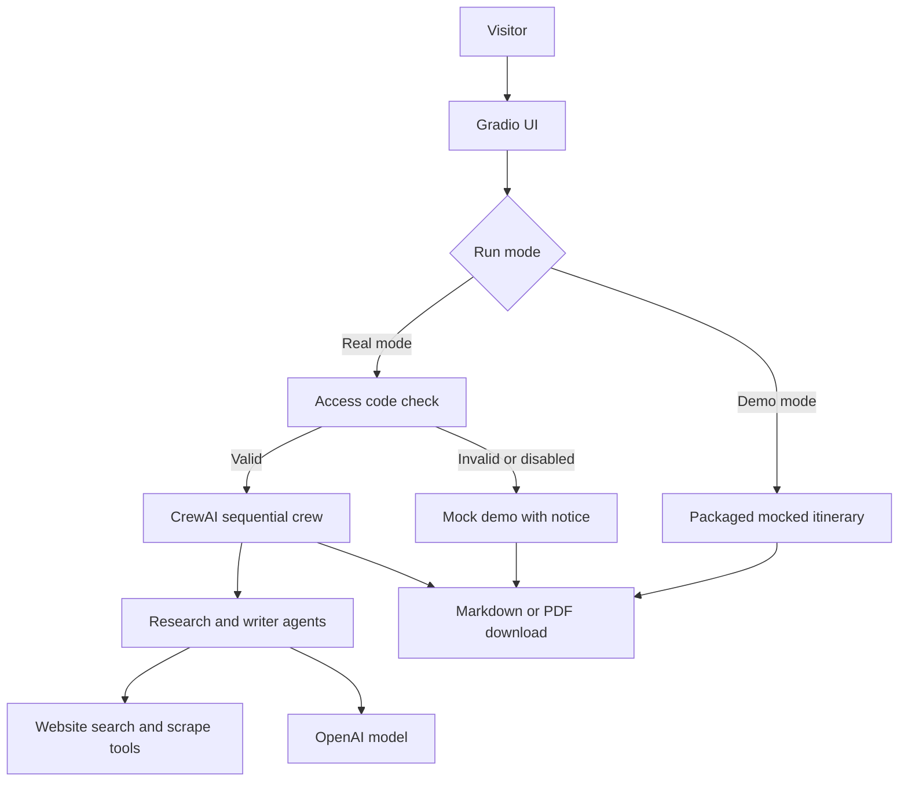

# National Park Trip Planner

A portfolio-grade AI trip planner that uses a CrewAI multi-agent workflow to research airports, flights, lodging, national park activities, and a final itinerary. The public UI includes a mocked demo mode for safe recruiter review and a gated real-run mode for authorized users.

**Live demo:** [Hugging Face Space](https://huggingface.co/spaces/Bkane56/national-park-trip-planner)  
**View code:** [GitHub repository](https://github.com/briankane/National_Park_Trip_Planner)

## Highlights

- Multi-agent CrewAI pipeline with role-specific research and writing agents.
- Gradio web UI with streamed progress updates and downloadable Markdown/PDF output.
- Public mocked demo mode that never calls OpenAI, CrewAI tools, web search, or paid APIs.
- Access-code-gated real mode controlled by server-side environment secrets.
- Python project managed with `uv`, tested with `pytest`, and deployable as a Hugging Face Docker Space.

## Tech Stack

- **Language:** Python 3.10-3.13
- **Agent framework:** CrewAI
- **UI:** Gradio
- **Exports:** Markdown and PDF via ReportLab
- **Dependency management:** uv
- **Testing:** pytest and pytest-cov
- **Deployment target:** Hugging Face Spaces using Docker

## Architecture



The important safety boundary is in `planner_service.py`: demo mode returns packaged sample content immediately. Real mode checks `REAL_RUN_ACCESS_CODE` from the UI against the server secret. A valid code authorizes one real run for that request only, even when `REAL_RUNS_ENABLED` is false. Missing or invalid codes fall back to mocked demo data without invoking paid APIs.

## Project Structure

```text
.
|-- app.py
|-- Dockerfile
|-- requirements.txt
|-- .github/workflows/
|   |-- ci.yml
|   |-- deploy-hf-space.yml
|   `-- keep-hf-space-alive.yml
|-- LICENSE
`-- national_park_crew/
    |-- DEPLOYMENT.md
    |-- pyproject.toml
    |-- src/national_park_crew/
    |   |-- app.py                    # Gradio UI composition
    |   |-- ui_handlers.py            # Run/download handlers
    |   |-- ui_helpers.py             # UI helper logic and request construction
    |   |-- planner_service.py        # Validation, demo mode, access gate, CrewAI runner
    |   |-- crew.py                   # CrewAI agents/tasks wiring
    |   |-- export_utils.py           # Markdown/PDF download helpers
    |   |-- demo_data/                # Packaged mocked itinerary data
    |   `-- config/
    |       |-- agents.yaml           # Agent roles, goals, and model choices
    |       `-- tasks.yaml            # Sequential planning tasks
    `-- tests/
        |-- test_app.py
        |-- test_assets.py
        |-- test_config_contract.py
        |-- test_export_utils.py
        |-- test_planner_service.py
        `-- test_theme_contrast.py
```

## Run Locally

Install `uv` if needed:

```bash
pip install uv
```

Install dependencies and start the Gradio UI:

```bash
cd national_park_crew
uv sync
uv run run_ui
```

Open `http://localhost:7860`.

By default, the UI runs in **Demo mode - mocked data**. That path does not require API keys.

## Real CrewAI Runs

Real runs require environment variables. Copy the example file and add your secrets:

```bash
cd national_park_crew
cp .env.example .env
```

Required for real runs:

- `OPENAI_API_KEY`: OpenAI key used by CrewAI agents.
- `REAL_RUN_ACCESS_CODE`: Private code entered in the UI to unlock a one-time real execution.

Recommended deployment default:

- `REAL_RUNS_ENABLED=false`: Marks the deployment as demo-first. Does **not** block real runs when a valid access code is supplied.

Optional operational toggles:

- `CREWAI_DISABLE_TELEMETRY=true`
- `OTEL_SDK_DISABLED=true`

If the access code is missing or incorrect, the app **falls back to mocked demo data** with a notice in the status panel. CrewAI and paid APIs are never invoked in that case.

The UI loads `national_park_crew/.env` automatically on startup for local development.

### Sharing with recruiters or trusted reviewers

1. Deploy the app (for example, a Hugging Face Space) with these secrets configured.
2. Share the live demo URL publicly on your portfolio.
3. Send the private `REAL_RUN_ACCESS_CODE` out of band (email or DM — never commit it).
4. Tell the reviewer to select **Real planning run - access code required**, paste the code, and click **Generate Itinerary**.

Public visitors who leave demo mode selected, or who select real mode without a valid code, always get the mocked itinerary.

### Kill switch

Remove or unset `REAL_RUN_ACCESS_CODE` on the deployment. Real mode will always fall back to mock data because no code can validate.

## Test

```bash
cd national_park_crew
uv run --group dev pytest
```

The tests cover request validation, mocked demo mode, real-run access gating, streamed planner updates, and export-file generation.

## Deployment Notes

The app is designed for a Gradio-based portfolio demo. Hugging Face Spaces is the preferred public demo host, but this project uses a **Docker Space** rather than the default Gradio SDK so dependency versions stay under project control.

Deployment behavior in this repo is split intentionally:

- `keep-hf-space-alive` pings the Space URL to reduce idle sleep on free tiers.
- `deploy-hf-space` publishes code updates to the Space.

If the Space is running but not reflecting recent GitHub commits, the deploy workflow or deploy token is the first place to check.

Recommended public setup:

- Link the Hugging Face Space as the **Live Demo**.
- Link this GitHub repository as **View Code**.
- Run the public Space in demo mode by default.
- Store `OPENAI_API_KEY`, `REAL_RUNS_ENABLED`, and `REAL_RUN_ACCESS_CODE` as Hugging Face Secrets, not in source control.

### Hugging Face deploy pipeline (single source of truth)

This repository is the source of truth for Space updates. Pushes to `develop` and `main` trigger `deploy-hf-space`, which uploads a clean Docker Space bundle to:

- `Bkane56/national-park-trip-planner`

Required GitHub repository secret:

- `HF_TOKEN`: Hugging Face User Access Token with write access to the Space repo.

See `national_park_crew/DEPLOYMENT.md` for additional deployment context.

## Why This Project Matters

This project demonstrates practical AI application engineering rather than a simple prompt wrapper: agent decomposition, external tool use, UI streaming, file export, test coverage, secret handling, and cost-aware demo controls. The public mock mode is intentional so reviewers can evaluate the product experience without triggering paid LLM usage.
